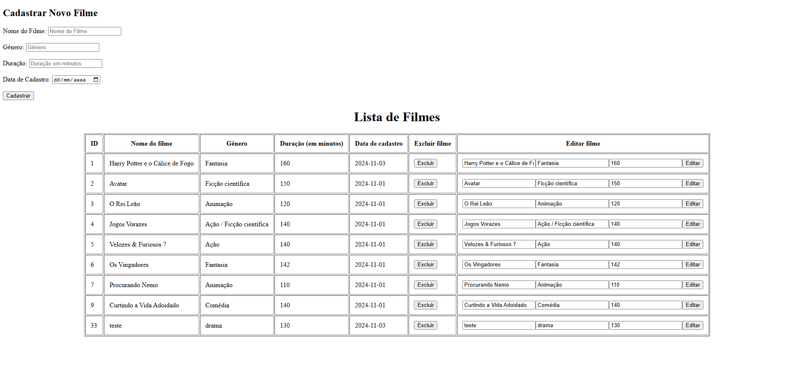

 <h1 align="center">Crud de filmes</h1>

## Funcionalidades
- Listagem de filmes
- Cadastro de novo filme
- Edição de filme existente
- Exclusão de filme

## Estrutura do Projeto
- `/src/main/java/br.com.filmes/`: Classes Java do projeto
- `/src/main/webapp`: Arquivos JSP e recursos web
- `/src/main/resources`: Scripts SQL e configurações

## Acesso à aplicação
- Url base - http://localhost:8080/tabelafilmes
- Página principal de filmes - http://localhost:8080/tabelafilmes/filme

## 🚀 Tecnologias
- JAVA
- MySQL
- Apache Tomcat 9.0
- Maven
- Servlet
- JSP

## Tela do projeto

## Conclusão
O projeto implementa uma aplicação simples e funcional de gerenciamento de filmes utilizando Java, MySQL, Apache Tomcat e Maven. Através da aplicação, é possível realizar operações básicas de CRUD (Criar, Ler, Atualizar e Deletar) em um banco de dados, proporcionando ao usuário a capacidade de listar, adicionar, editar e excluir filmes de forma intuitiva.

## Ambiente
1. Servidor: Apache Tomcat 9.0
2. Porta padrão: 8080
3. Context path: /tabelafilmes

## Contato
- murilopizolito@gmail.com
